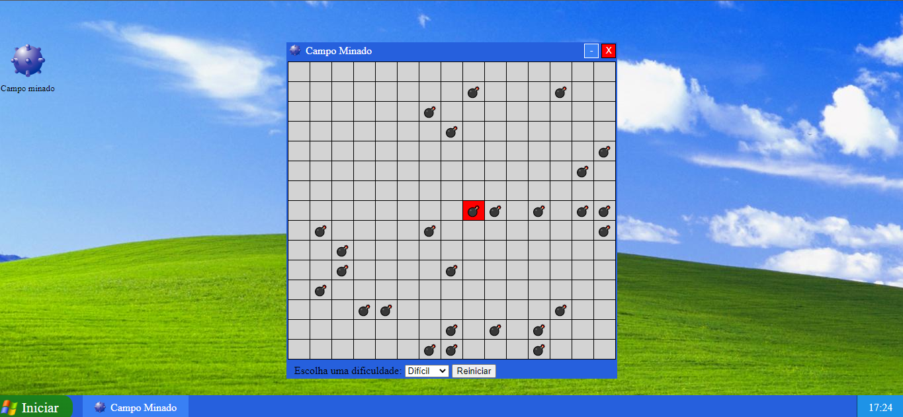

# Windows XP + Minesweeper

## Used technologies:
<code></code>
<code></code>
<code></code>

## Projeto:

>Minesweeper picture

Windows XP basic funcionalities and style cloned on a website.
By now, Minesweeper Shortcut is avaliable at the "Desktop" and playable.

## Project logs and upgrades

This project still being developed...

- [x] Interface of Windows XP created.
- [x] 'Minimize' and 'Close' functions created for "app window"
- [x] Minesweeper
- [ ] Start Menu
- [ ] Multi-task opening apps

To see my project on live, please access:

https://amerele.github.io/mine-sweeper-JS/

