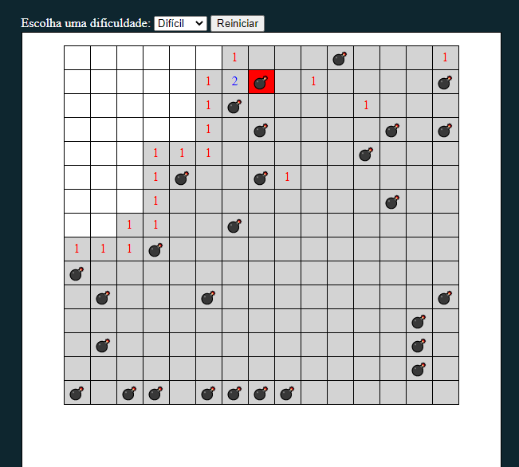

# Mine Sweeper - Campo Minado

> Campo minado criando com a utilização de javascript puro (vanilla) e corporizado com HTML e CSS.

### Ajustes e melhorias

O projeto ainda está em desenvolvimento e as próximas atualizações serão voltadas nas seguintes tarefas:

- [x] Planejamento e mapeamento das funcionalidades
- [x] Desenvolvimento
- [x] Funcionalidades - Projeto já está funcional
- [ ] Estilização

Para ver o projeto hospedado, acesse:

https://amerele.github.io/mine-sweeper-JS/

[⬆ Voltar ao topo](#nome-do-projeto) 
